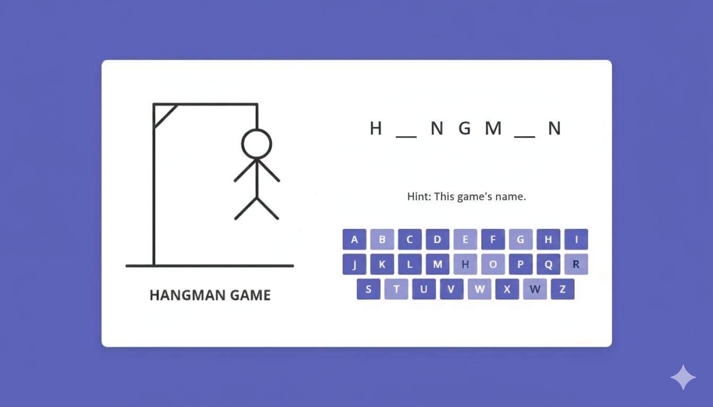

# ng-hangman 🎯




[](https://angular.io/)
[](https://github.com/Hemanth7723/ng-hangman)
[](https://github.com/Hemanth7723/ng-hangman/commits/main)

A lightweight, responsive Hangman game built with Angular, TypeScript, and SCSS — ideal for learning Angular, practicing front-end patterns, or embedding in a learning site. Playable in the browser, keyboard-friendly, and easy to customize. 😊

---

## **Table of contents**
- [**Demo**](#demo)
- [**Highlights**](#highlights)
- [**Tech stack**](#tech-stack)
- [**Quick start**](#quick-start)
  - [**Prerequisites**](#prerequisites)
  - [**Clone, install, run**](#clone-install-run)
- [**Development**](#development)
  - [**Available scripts**](#available-scripts)
  - [**Architecture & key files**](#architecture--key-files)
- [**Customizing game data**](#customizing-game-data)
- [**Accessibility & UX considerations**](#accessibility--ux-considerations)
- [**Testing**](#testing)
- [**Deployment**](#deployment)
- [**Contributing**](#contributing)
- [**Troubleshooting & FAQ**](#troubleshooting--faq)
- [**Acknowledgements**](#acknowledgements)

---

## **Demo**
- Live demo: (Not hosted by default) — run locally following Quick start to try it immediately.
- Preview: (image above) — replace the placeholder with your own screenshots in `assets/` for a nicer README.

---

## **Highlights** ✨
- Clean Angular implementation using components, services, and reactive patterns
- Responsive UI with SCSS and accessible controls (keyboard & screen-reader friendly)
- Configuration-driven game rules (max wrong attempts, categories, word lists)
- Minimal dependencies for easy maintenance

---

## **Tech stack** 🧰
- Angular + TypeScript
- SCSS for styling
- HTML for markup
- Optional: Angular CLI for local dev tooling

---

## **Quick start** 🚀

### **Prerequisites**
- Node.js 14+ (LTS recommended)
- npm 6+
- Optional but recommended: Angular CLI (`npm i -g @angular/cli`)

### **Clone, install, run**
1. Clone the repository
```bash
git clone https://github.com/Hemanth7723/ng-hangman.git
cd ng-hangman
```

2. Install dependencies
```bash
npm install
```

3. Run the dev server
```bash
ng serve --open
# or if you don't have the CLI installed:
npx ng serve --open
```
The app will open in your default browser at http://localhost:4200.

---

## **Development**

### **Available scripts**
- ng serve — Run dev server
- ng build — Build project (use `--configuration production` for production)
- ng test — Run unit tests (if present)
- ng e2e — Run end-to-end tests (if set up)

If package.json contains additional scripts, run `npm run` to see them all.

### **Architecture & key files** 🔎
The project follows standard Angular app structure. Key locations:
- src/app/
  - app.module.ts — root module
  - app.component.* — root component and global layout
  - components/
    - game-board/ — Hangman visual & letter grid
    - keyboard/ — on-screen keyboard component
    - header/ — top bar or controls (new game, difficulty)
    - score/ — score or session summary
  - services/
    - game.service.ts — core game logic (word selection, attempt tracking, game state)
    - words.service.ts — manages word lists and categories (can be local or fetched)
  - models/
    - word.model.ts — shape of word or category objects
- src/assets/
  - words.json or categories/ — store word lists here (local JSON or text files)
  - images/ — screenshots and icons used by the app
- src/styles/ — global SCSS
- environments/ — Angular environment files for configs

Design notes (what to look for in code)
- GameService is the single source of truth for current puzzle, guessed letters, remaining attempts, and game state transitions.
- Components are intentionally dumb/presentational where possible; they receive state via Inputs and emit events via Outputs.
- Word lists are abstracted behind WordsService to make swapping to remote lists or APIs trivial.

---

## **Customizing game data** 🛠️
- Word lists: Add JSON or text files under `src/assets/words/`. Typical JSON shape:
```json
{
  "category": "Animals",
  "words": ["elephant", "tiger", "kangaroo"]
}
```
- Configure max attempts: Search for `MAX_ATTEMPTS` or similar in `game.service.ts`. Make it configurable via a component control or environment variable.
- Categories: Add additional categories, update UI select component to read categories dynamically from `WordsService`.

---

## **Accessibility & UX considerations** ♿
- Keyboard controls: All letter buttons should be reachable via keyboard (tab) and operable with Enter/Space.
- ARIA: Use `aria-pressed` for letter buttons and landmarks for game area and controls to help screen readers.
- Color contrast: SCSS uses accessible color combinations; ensure any added theme maintains contrast.
- Motion: Avoid flashy animations by default; provide reduced-motion preference.

---

## **Testing** ✅
- Unit tests: Use `ng test`. Aim to cover GameService logic (state transitions, guesses, win/lose conditions).
- E2E tests: Use Cypress or Protractor if configured. Test main flows: start game, guess letters, win, lose, and restart.

---

## **Deployment** 🌐
- Static hosting (GitHub Pages, Netlify, Vercel): Build and upload the `dist/` folder produced by `ng build --configuration production`.
- GitHub Pages (example):
```bash
# build
ng build --configuration production --base-href /ng-hangman/

# deploy (one approach):
npx angular-cli-ghpages --dir=dist/ng-hangman
```
- Docker (optional): Build a small nginx image serving `dist/`.

---

## **Contributing** 🤝
Thank you for considering contributing! Suggested workflow:
1. Fork the repo
2. Create a feature branch
```bash
git checkout -b feature/my-feature
```
3. Make changes and add tests
4. Commit and push
5. Open a pull request with a clear description and screenshots if UI changes

Guidelines
- Keep commits small and focused
- Follow Angular style and use TypeScript types
- Add or update tests for new logic

---

## **Troubleshooting & FAQ** 🙋‍♀️

**Q: The app doesn't start — error about Angular CLI version**  
A: Run with npx to avoid global CLI mismatch:
```bash
npx ng serve --open
```

**Q: I get dependency errors after pulling**  
A:
```bash
rm -rf node_modules package-lock.json
npm install
```

**Q: Where do I add new words?**  
A: Add them to `src/assets/words/` (or wherever `WordsService` reads from). Keep JSON format consistent.

**Q: How do I change number of attempts?**  
A: Edit the constant in `game.service.ts` or add a UI control to configure it at runtime.

FAQ — quick tips
- Use all lowercase for words in lists for consistent matching.
- Sanitize punctuation or accents if you want to simplify matching logic.

---

## **Security & privacy**
- This is a client-side game storing no user data by default. If you later add analytics or remote services, display a privacy notice and follow best practices.

---

## **Acknowledgements** 🙏
- Inspired by classic Hangman implementations and Angular learning resources.
- Built as an educational project — contributions and improvements are welcome.

---

If you'd like, I can:
- Replace the placeholder preview image with actual screenshots from your repo (if you add them to `src/assets/images/`).
- Add automated badges (CI passing, coverage) once CI is set up.
- Create a minimal CONTRIBUTING.md or CODE_OF_CONDUCT.md to accompany this README.

Happy hacking! 🧩
